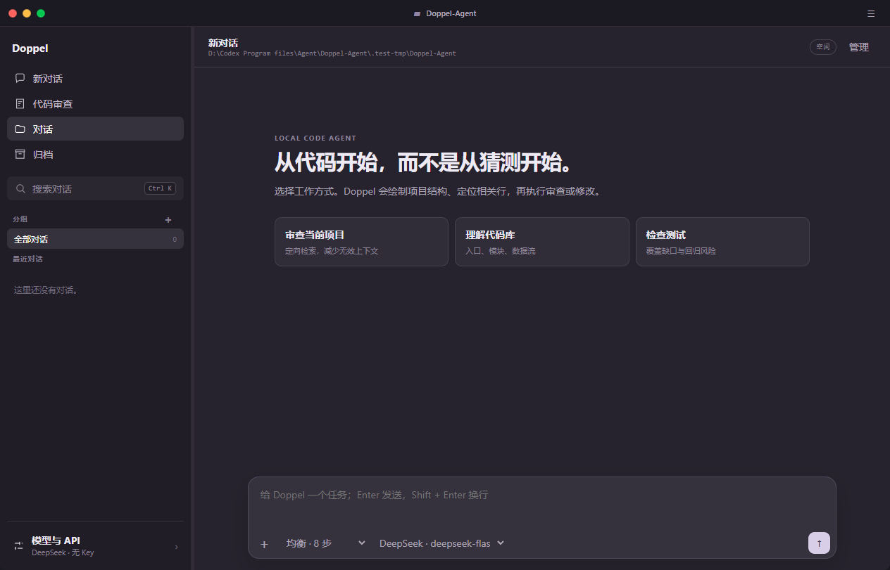

# Doppel Agent

一个在本机运行的编程 Agent。可通过 Windows 桌面窗口、浏览器工作台或命令行连接模型、执行任务，并查看模型回合、工具调用与最终结果。

**语言：简体中文 · [English introduction](README_EN.md)**

> 当前版本：`v0.10.0`。项目仍在开发中；已实现的功能与后续计划分开列出，不以参考项目的指标作为本项目成绩。



## 功能

- **Agent Loop**：模型发起工具调用，Core 校验并执行，再把结果返回模型；单次运行有最大步数限制。
- **三运行时**：保留 `legacy` ReAct 基线、LangGraph `graph` 主链，并增加可选 Deep Agents `deep` 模式；三者共用异步 Runtime 契约，Graph/Deep 使用 SQLite Checkpointer。
- **Deep Agents 适配**：自定义 `BaseChatModel` 复用现有 OpenAI-compatible Provider；`DoppelBackend` 拒绝秘密文件、状态目录、路径逃逸和内置 shell；深度模式最多两个只读子 Agent，分别限制模型调用与 Token 预算，异常会记录后降级到 focused graph。
- **可恢复审批**：写入和命令在副作用前触发 interrupt；批准、拒绝、编辑均可 resume，工具幂等账本阻止重复执行。
- **异步 API 与事件流**：FastAPI `/api/v1` 提供提交、查询、取消和恢复；持久化 SSE 支持按 `after_seq` 断线续传。
- **受控并发**：有界 FIFO 队列、运行取消、工作区读写锁，以及 Provider profile/命令资源限流；队列满返回明确 429。
- **Provider 可靠性**：Graph 模式使用长生命周期异步 HTTP client；429/5xx 有界退避、`Retry-After`、retry budget、deadline 和 circuit breaker 可测试。
- **审查工具**：工作区文件图、递归文本检索、按行读取、普通读写与 argv 命令；审查优先窄化范围，减少整文件上下文浪费。
- **权限**：默认只读；写文件和运行命令必须在本次任务中明确启用。命令工具不是操作系统沙箱。
- **模型接入**：支持多个 OpenAI-compatible 模型档案（名称、Base URL、模型、Key 与可选单价），可在每个对话中切换，也提供离线 Mock。
- **Agent 工作台**：Ghostty 风格三色窗口按钮与无白边圆角窗口，默认采用 Codex 式双栏布局；右上角菜单按需展开可调宽度的执行详情，模型选择位于输入区。
- **持久对话**：消息自动写入 SQLite，支持 `Ctrl+K` 全局搜索标题与消息正文、重命名、分组、归档、删除和重启恢复；同一对话历史会继续参与模型推理。
- **效率证据**：快速/均衡/深度三档限制 Agent 步数；执行面板显示耗时、工具调用、Token 与按模型单价估算的费用。成本结论仍需同模型同任务基线。
- **安全保存模型配置**：Base URL 与模型名保存在当前工作区；API Key 使用 Windows DPAPI 按当前用户加密，明文不会返回浏览器。
- **Windows GUI**：独立桌面窗口复用同一套本机工作台；无需使用 TUI，关闭窗口即停止该实例的本地服务。
- **运行记录**：每次任务生成独立 ID，并写入 `events.jsonl`、`trace.jsonl`、`session.json`。
- **任务与上下文**：SQLite 持久化任务依赖图；上下文到达估算水位时压缩旧工具回合并记录事件。
- **Agent Skills Registry**：兼容 `.doppel/skills/`，并支持 `skills/`；校验 frontmatter、唯一名称、大小、链接路径和疑似明文密钥，通过 progressive disclosure 先暴露摘要、命中后再加载正文。仓库内置 code-review、bugfix、test-repair、mcp-operations 四个工作流 Skill。
- **MCP SDK Gateway**：支持 stdio 与 Streamable HTTP；统一 session 生命周期、健康探针、重连、分页 catalog、schema 缓存、每服务器 semaphore、参数校验、HITL、幂等、审计以及文本/图片/音频/resource/structured content。模型只看到规范化的 `mcp__server__tool`，不能绕过网关直连。
- **只读子任务**：按次启用委派，子任务最多两次、每次最多四轮，只能读取工作区，不能继续委派；会产生额外模型调用与费用。
- **常驻 Core**：CLI 与 daemon 使用 localhost JSON-RPC/NDJSON 通信。

## 快速开始

要求：Windows 10、Python 3.11 或更新版本。旧 `legacy` CLI 仍可使用基础依赖；LangGraph/FastAPI 主链安装 `agent` 依赖组。

```powershell
cd '<你的 Doppel-Agent 仓库目录>'
.\doppel.cmd doctor
.\doppel.cmd ui
```

打开 [http://127.0.0.1:8766/](http://127.0.0.1:8766/)；点击左下角“模型与 API”，填写 API Base URL、模型名称和 API Key，测试后保存，再开始对话。`ui` 仅监听 `127.0.0.1`。配置保存在当前工作区 `.doppel-agent/`；Key 由 Windows DPAPI 加密，只能由同一台电脑上的当前 Windows 用户解密，接口不会把明文发回页面。

### Windows 桌面 GUI（无需 TUI）

已构建的程序位于 `D:\Codex Program files\Agent\Doppel-Agent\.dist\DoppelAgent\DoppelAgent.exe`。保留同目录的 `_internal` 文件夹；双击 EXE 即可打开独立窗口。默认把启动时的当前目录作为工作区；指定其他项目时：

```powershell
& 'D:\Codex Program files\Agent\Doppel-Agent\.dist\DoppelAgent\DoppelAgent.exe' --workspace 'D:\your-project'
```

桌面 GUI 需要系统安装 Microsoft Edge WebView2 Runtime；Windows 10 上如果缺少它，程序会显示启动错误。它复用 Web 控制台的功能和安全边界，但使用随机的 `127.0.0.1` 端口，关闭窗口会停止这个实例。对话和加密后的 API Key 会保存在所选工作区。

左上三色按钮依次为关闭、最小化和最大化/还原，双击标题栏也可切换最大化；右上角菜单用于显示或隐藏执行详情。“新对话”和“代码审查”会分别复用尚未发送的空草稿。“代码审查”先显示全面审查、安全与权限、缺陷与异常、测试与回归四种模板，选择后才把提示词放入输入框，**不会自动消耗模型额度**；点击发送按钮后才会开始运行。按 `Ctrl+K` 可搜索全部对话及归档内容。

重新构建：`./scripts/build-desktop.ps1`。脚本在项目 `.venv` 安装 `pywebview` 和 `PyInstaller`，产出无控制台窗口的 onedir EXE。也可通过 `python -m pip install -e '.[desktop]'` 后执行 `doppel-agent desktop --workspace 'D:\your-project'`。

不想先配置模型，可在服务类型中选择“离线 Mock”。它用于测试 UI 和执行链路，**不具备通用编程能力**。

### v0.10 Runtime API

```powershell
python -m pip install -e ".[agent]"
.\doppel.cmd api --workspace 'D:\your-project' --port 8765
```

打开 `http://127.0.0.1:8765/api/docs` 查看 OpenAPI。新接口位于 `/api/v1/*`；`POST /api/v1/runs` 默认使用 `graph`，可传 `mode: "legacy"` 做基线，或传 `mode: "deep"` 启用 Deep Agents。事件接口支持普通 JSON 回放，也支持 `?stream=true&after_seq=<序号>` 的 SSE 续传。桌面程序在同一 loopback origin 暴露新 API，并把尚未迁移的 v0.8 页面与接口代理到兼容服务。

### 命令行

```powershell
# 离线链路测试
.\doppel.cmd demo "read README.md"

# 真实模型：在当前 PowerShell 会话设置，不要提交密钥文件
$env:DOPPEL_AGENT_BASE_URL = 'https://api.deepseek.com'
$env:DOPPEL_AGENT_MODEL = 'deepseek-flash'
$env:DOPPEL_AGENT_API_KEY = '<你的 API Key>'
.\doppel.cmd ask '列出当前目录，并解释项目结构'

# 需要修改文件时，单次显式授权
.\doppel.cmd ask '创建 hello.py' --allow-write
```

Base URL 后会自动追加 `/chat/completions`。服务需要兼容 Chat Completions 的 `tools` / `tool_calls` 格式；不同提供商的模型名请以其文档为准。

### MCP 扩展

安装 `python -m pip install -e ".[agent]"`，再按 [MCP Gateway 配置说明](docs/MCP.md) 创建配置。Graph/Deep 只在本次运行授予 `mcp_execute` 后加载规范化工具，并在真实调用前持久化审批。HTTP 认证仅在环境变量中按 auth profile 提供；配置文件不保存令牌。**stdio 服务仍以当前用户运行，不是操作系统沙箱。**

### 只读子任务

Web 勾选“允许只读子任务”，或 CLI 添加 `--allow-delegate`。该能力默认关闭；子任务共享本次任务的模型连接，限制为读文件/列目录、四轮模型调用和 8000 字符的返回值。它不是并行执行器，也不会继承父任务的写入、命令或 MCP 权限。

### 测试

```powershell
$env:PYTHONPATH = (Resolve-Path .\src).Path
python -m pytest -q
ruff check src tests
```

测试包含本地 HTTP 模型替身的完整工具回合、Web 控制台接口、daemon/client 通信、路径越界与权限拒绝。没有配置真实 API Key 时，这些测试**不能**证明某个付费提供商的在线可用性。

### 真实代码审查验收

`bench/` 提供独立的合成代码审查样本：运行时只把样本 `service.py` 放入临时工作区，答案键不会暴露给 Agent。若已拥有 DeepSeek Key，可运行：

```powershell
python bench/run_review.py --env-file '<你的本机 .env 路径>'
```

报告存入忽略提交的 `.bench-results/`；密钥不写入报告。三轮合成题与三个真实项目的分层结果、SWE-bench 接入边界见 [代码审查测试策略](docs/BENCHMARK_STRATEGY.md)，早期逐项结果见 [审查验收记录](bench/reports/2026-09-19-review-001.md)。一个样本不能证明通用成功率。

## 安全边界

Web 控制台只向本机开放，拒绝跨站来源请求；API Key 仅以 Windows DPAPI 密文持久化。模型可能收到工具读取的文件内容，因此应只对可信工作区和可信模型服务启用读取。文件工具拒绝常见密钥文件和自身状态目录，但黑名单不能替代工作区审查。`--allow-command` 允许以当前用户身份运行程序，不应在不可信代码目录使用。

旧 Web 已提供写入/命令/MCP 的逐工具审批（120 秒超时自动拒绝）；LangGraph v1 API 的 interrupt 默认 900 秒过期并持久化。CLI/daemon 仍不提供交互审批，其显式授权会直接生效。取消同步 legacy Provider 的 await 不能强制停止已经进入系统线程的阻塞请求；Graph/Deep 的异步 Provider 可立即传播取消。当前仍没有强隔离、diff-first patch/verification pipeline、异步并行子 Agent、TUI 或独立三运行时基准成绩。完整阶段与验收标准见 [实施规划](docs/PLAN.md)及 [LangGraph/Deep Agents 详细计划](docs/plans/2026-09-20-langgraph-deepagents-mcp-concurrency.md)。

## 版本与来源

版本按功能迭代发布；每次推送应更新版本号、[更新记录](CHANGELOG.md)并通过测试。项目独立开发，设计上参考了 [TackleClaude](https://github.com/Tackle-B/TackleClaude) 对本地 Agent 运行时的公开介绍；没有复制其源码，也不沿用其成本、成功率等数据。
