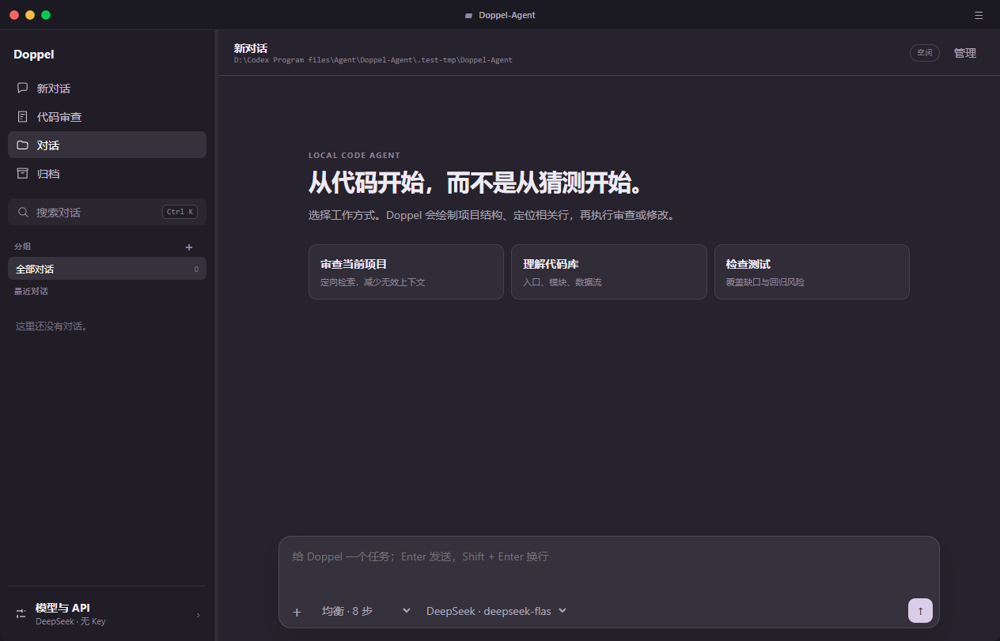

# Doppel Agent

A local coding agent with a Windows desktop GUI, a browser-based console, and a CLI. Connect an OpenAI-compatible Chat Completions endpoint, run a task, and inspect every model/tool step.

**Language: [简体中文](README_CN.md) · English**

## Local Coding Workbench prerelease — v0.15.0-rc.1

**Start here: [User guide](docs/USER_GUIDE.md) · [Troubleshooting](docs/TROUBLESHOOTING.md) · [中文使用指南](docs/USER_GUIDE_CN.md)**

The prerelease carries durable native Graph/Deep/reviewed Legacy conversations,
plans/tasks, explicit context, changes/verification, extensions, reports and the
accepted compact desktop interface with a titlebar Help menu. Native conversations,
standalone Runtime and older Legacy history are distinct; there is no automatic
history conversion. Desktop `/` redirects to `/runtime/`; `/legacy/` preserves the
older console; standalone `ui` is the lightweight Legacy console.

This is **a prerelease, not full S0–S10/native matrix acceptance or a stable v1.0**.
The historical stable source remains v0.14.4. New focused help/UI/build checks do not
promote old FAIL/UNKNOWN batches, native subsets or engineering/Mock results into
model quality, Token savings or production reliability. No paid model evaluation
was performed. See [current release scope and receipts](docs/releases/2026-10-08-help-prerelease.md)
and the [whole-goal handoff](docs/plans/2026-10-06-new-session-whole-goal-handoff.md).

Build an isolated, explicitly untested candidate using existing dependencies:

```powershell
./scripts/build-candidate.ps1 -OutputDirectory '.artifacts/my-new-candidate'
```

The output must be new. It contains a wheel, sdist and windowed onedir EXE with
its required `_internal` folder, stage logs and a source/artifact manifest. The
builder does not install dependencies, launch the application or run test suites,
and does not replace the daily `.dist/DoppelAgent` installation.

## Current release: v0.14.4

This patch repairs cancellation during RunService initialization/finalization, drains owned SQLite writes before publishing a cancelled terminal state, and preserves operation cleanup when cancellation precedes coroutine entry. Deterministic scripted nav-04/tdd-01..04/patch-01 fixtures are grounded, not paid model-quality results. Capability eligibility remains 81 direct-factory /126 service paths out of the original 180; full mode remains blocked. See [update and test evidence](docs/releases/v0.14.4.md). Historical failed CI/tags are not rewritten.

**Unreleased v0.15 candidate (2026-10-03):** all 13 Task 5B fixtures have local deterministic controls. The candidate adds a parallel Vue persistent-conversation page, official DeepSeek non-thinking compatibility, and one shared 10 CNY request ledger for the guarded navigation/review runner only—not ordinary desktop chats or an account-wide cap. Latest local Python validation: 637 passed, 2 skipped; the isolated new EXE passed seven scripted runtime cases, native-window checks, and owned-process/SQLite cleanup checks. Paid canaries, human adjudication, a clean candidate commit and exact-commit CI/release gates remain pending. Full 180 mode and complete UI replacement remain blocked. See [dated evidence, failures and boundaries](docs/releases/2026-10-02-v0.15-acceptance-progress.md#2026-10-03-deepseek预算与最终新-exe-补记). These results do not change the current v0.14.4 release or establish model quality.



- Bounded agent loop with validated tool calls and tool-result feedback.
- A unified async runtime contract with `legacy`, durable LangGraph `graph`, and optional Deep Agents `deep` modes.
- A provider-backed `BaseChatModel`, policy-constrained `DoppelBackend`, bounded read-only subagents, and recorded fallback to the focused graph.
- SQLite checkpoints plus approve/reject/edit interrupts and a tool-call idempotency ledger.
- Diff-first multi-file patches with reviewed base hashes, stale-base rejection, atomic rollback, and durable proposed/applied/conflict events in both Graph and Deep modes.
- A project-owned `.doppel/verification.json` argv allowlist with structured results; approved patches can automatically run configured checks when command capability is granted.
- Cancellable command trees using a Windows Job Object first and an explicit `taskkill /T` fallback, plus persistent bounded async subagents exposed through parent-scoped create/list/get/follow-up/cancel REST endpoints. Children remain read-only and non-recursive.
- FastAPI `/api/v1` run lifecycle endpoints, durable resumable SSE, bounded FIFO scheduling, cancellation, workspace read/write locks, resource limits, and atomic failed-state reconciliation for queued/running leases lost across a service restart.
- A Vue 3 + TypeScript + Vite Runtime Workbench at `/runtime/` for legacy/graph/deep launches, queue/runtime metrics, durable event grouping, HITL approve/reject/edit, exact diffs, and async subagent lifecycle controls.
- A long-lived async HTTP provider with bounded 429/5xx retry, `Retry-After`, deadlines, and a profile circuit breaker with a single half-open probe.
- Compact workspace maps, recursive text search, line-range reads, UTF-8 read/write, and argv-only command execution.
- Read-only by default; writing and command execution require explicit per-run grants.
- A frameless desktop window without transparent white padding, Ghostty-style traffic-light controls, and a Codex-style two-pane default workspace; the resizable run inspector opens from the top-right menu.
- Multiple custom provider profiles and per-conversation model switching; optional prices drive transparent per-run cost estimates.
- Persistent conversations with `Ctrl+K` search across titles, message bodies, and archived items; per-workspace provider settings use Windows DPAPI for API keys.
- A native Windows GUI window backed by the same local console, built with pywebview and PyInstaller; no TUI is required.
- Per-run `events.jsonl`, `trace.jsonl`, and `session.json` records.
- SQLite task dependency graph, estimated context-watermark compaction, and a strict progressive-disclosure Agent Skills registry with four built-in engineering workflows.
- Per-tool manual approval for writes/commands in the web console; saved runs can be replayed after restarting the console.
- A policy-aware MCP SDK gateway for stdio and Streamable HTTP with pooled lifecycle management, health/reconnect, generation-invalidated paginated schema caching, per-server semaphores, HITL, idempotency, audit events, and typed multimodal results.
- The legacy loop retains opt-in read-only subagents capped at two delegations and four model turns per run. Deep mode instead exposes two read-only specialist subagents, each bounded to six model calls and an 8,000-token budget; neither path inherits write, command, MCP, or recursive-delegation capability.
- CLI plus a localhost JSON-RPC/NDJSON daemon.
- An isolated synthetic code-review case with a reproducible live-provider runner and a manually adjudicated result; no general benchmark claims.
- A fixed 20-case × 3-runtime × 3-repeat protocol, a 180/180 offline Mock runtime-path smoke report with null task scores, deterministic local scheduler/lock load evidence, and a committed 10/10 offline fault-injection matrix for Provider, MCP, SSE, restart recovery, and process timeouts.

This release does **not** include a CLI/daemon interactive approval workflow, a precise provider tokenizer, strong OS isolation, a TUI, full Vue parity for legacy conversations/settings, or a real-model adjudicated three-runtime quality benchmark. The Mock matrix validates plumbing only. See the [implementation plan](docs/plans/2026-09-20-langgraph-deepagents-mcp-concurrency.md).

## Start on Windows

Requires Python 3.11+. The legacy CLI remains lightweight; install `.[agent]` for the LangGraph/FastAPI runtime.

```powershell
cd '<your Doppel-Agent repository directory>'
.\doppel.cmd ui
```

Start the v0.14 API with `python -m pip install -e ".[agent]"` and `.\doppel.cmd api --workspace 'D:\your-project' --port 8765`; OpenAPI is at `/api/docs`, versioned endpoints are under `/api/v1`, and run mode may be `legacy`, `graph`, or `deep`. The desktop hybrid server exposes the Vue workbench at `/runtime/`; a parent run created with `permissions.delegate=true` owns the nested `/runs/{run_id}/subagents` lifecycle endpoints.

Open [http://127.0.0.1:8766/](http://127.0.0.1:8766/), open **Model & API** in the lower-left corner, enter the endpoint, model and key, test, save, then start a conversation. Conversations and settings live under the selected workspace's `.doppel-agent/`; the key is stored only as a current-user Windows DPAPI ciphertext and is never returned by the settings API.

Offline smoke test:

```powershell
.\doppel.cmd demo "read README.md"
$env:PYTHONPATH = (Resolve-Path .\src).Path
python -m unittest discover -s tests -v
```

The mock is deterministic and cannot perform general coding tasks. The synthetic live review plus read-only reviews of three real local projects are documented in the [benchmark strategy](docs/BENCHMARK_STRATEGY.md); they are not a general benchmark or a SWE-bench score.

### Windows GUI executable

The tested onedir build is at `D:\Codex Program files\Agent\Doppel-Agent\.dist\DoppelAgent\DoppelAgent.exe`. Keep the `_internal` directory beside it. Double-click to use the current directory as workspace, or pass `--workspace 'D:\your-project'`. The GUI needs Microsoft Edge WebView2 Runtime. Rebuild with `./scripts/build-desktop.ps1`; the script installs the optional desktop dependencies into `.venv`. The embedded server binds to a random `127.0.0.1` port and stops when the window closes.

The traffic-light buttons close, minimize, and maximize/restore the window. The top-right menu toggles the run inspector. **New Conversation** and **Code Review** each reuse an existing empty draft. Code Review first offers four review templates and only fills the composer after a choice; it never calls the model until the user explicitly sends the prompt. Press `Ctrl+K` to search all active and archived conversations.

For MCP, install `python -m pip install -e ".[agent]"` and follow the [MCP Gateway guide](docs/MCP.md). Stdio servers run as the current user and are not an OS sandbox; HTTP auth tokens are resolved from environment profiles rather than stored in JSON.

## Security

The web console binds to `127.0.0.1` and rejects cross-origin requests. Web write/command/MCP calls require both the per-run checkbox and approval of the individual call; approval expires after 120 seconds. CLI/daemon grants are not interactive. File tools enforce workspace boundaries. `--allow-command` and MCP run programs as the current user and are **not** an OS sandbox. A model can receive file content returned by tools; use a trusted workspace and provider.

## Project notes

Releases use version increments and a [changelog](CHANGELOG.md). The architecture was informed by the public description of [TackleClaude](https://github.com/Tackle-B/TackleClaude), but this repository is an independent implementation and does not claim its published benchmarks.

See the [v0.14.0 release evidence and next-stage plan](docs/releases/v0.14.0.md) for exact gates, limitations, and the v0.15/v1.0 roadmap.
