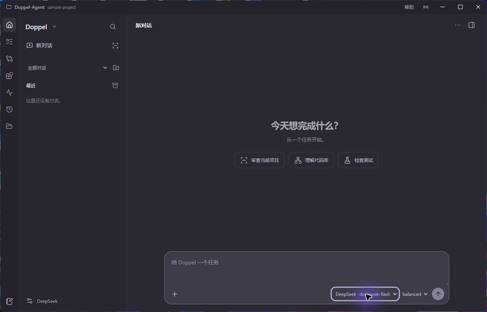
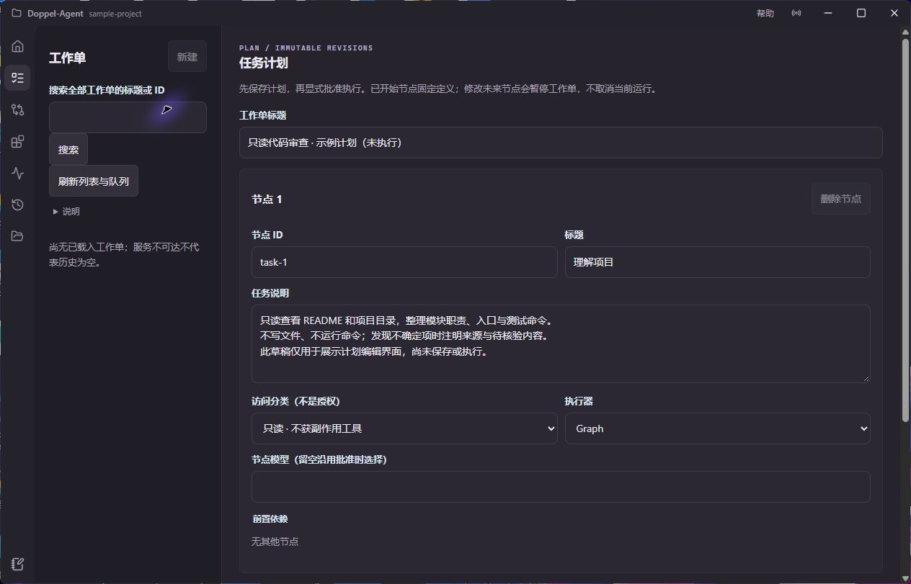
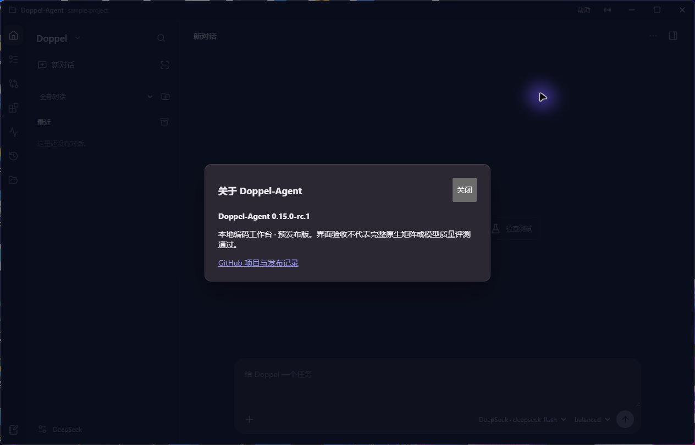

# Doppel Agent

一个在本机运行的编程 Agent，也是面向 Windows 的本地编码工作台。连接 OpenAI-compatible Chat Completions 模型，在同一项目里理解代码、审查变更、编排任务，并查看对话、显式上下文、审批和执行证据。

**简体中文 · [English](README.md)**

**最新预发布：[v0.15.0-rc.1](https://github.com/zureealLV/Doppel-Agent/releases/tag/v0.15.0-rc.1)** · Windows x64 · Python 3.11+ · MIT

[下载 Windows 桌面版](https://github.com/zureealLV/Doppel-Agent/releases/download/v0.15.0-rc.1/DoppelAgent-v0.15.0-rc.1-windows-x64.zip) · [使用指南](docs/USER_GUIDE_CN.md) · [故障排除](docs/TROUBLESHOOTING_CN.md) · [发布范围](docs/releases/2026-10-08-help-prerelease.md)



*2026-10-08 在隔离示例项目中实拍预发布 EXE。这是新版 Vue 工作台，不是历史 v0.8.2 控制台；本组截图没有提交任务或模型请求。*

## 可以做什么

| 工作区 | 已实现的能力 |
|---|---|
| **持久对话** | 原生 Graph、Deep 与受审 Legacy 对话，`Ctrl+K` 搜索标题/消息，分组、归档、审查模板，按次选择模型档案与力度，按需展开执行详情。引擎在创建对话时固定。 |
| **计划与任务** | 带版本的工作单、节点依赖、执行器与模型选择，显式批准派发，持久任务与运行队列。保存计划不会自动执行。 |
| **上下文与笔记** | 文件片段、已接受快照、带来源的事实/约束/决策；上下文需显式绑定并在准入时冻结，不是打开面板就自动生效。 |
| **变更与验证** | 分开查看当前 Git 快照与历史补丁，审阅带 base hash 的多文件 diff、审批和冲突。精确逆操作需要保留前像与新鲜检查；验证只用项目配置 argv，要求命令授权及单独审批。 |
| **扩展中心** | MCP 配置/缓存目录与 Agent Skills 元数据，内置四个工程 Skill。连接探测和刷新需确认，打开页面不等于工具授权。 |
| **执行与报告** | 持久事件、工具调用、审批、有界只读子任务、用量及声明单价估算。未知用量/费用不是零，也不是账单。 |
| **项目与帮助** | 原生目录/最近项目选择与受保护的切换；紧凑侧栏和输入区、可选执行详情，标题栏提供文档、快捷键、故障排除与实际构建版本。 |

## 新版界面

**计划与任务：只读示例草稿，不是执行成果**



**帮助 / 关于：显示当前构建的真实版本**



[截图来源](docs/images/README.md)。图片是未经修饰的原生窗口实拍，只用于展示界面，**不代表完整原生验收或模型质量结果**。

## 运行时与技术架构

- **三引擎**：Legacy 基线、持久化 LangGraph `graph` 主链、可选 Deep Agents `deep`，共用异步 Runtime 契约。Deep 使用项目自有 backend 和有界只读专家子任务，降级会记录事件。
- **持久执行**：SQLite 对话/checkpoint、批准/拒绝/编辑中断、工具幂等账本、可续传 SSE、有界 FIFO 调度、工作区锁，以及取消/重启状态收敛。
- **先审阅再产生副作用**：diff-first 多文件补丁、旧 base 拒绝、回滚与项目验证白名单；写文件、命令、MCP、委派按次显式授权，授权不替代单独审批。
- **模型与扩展**：多 OpenAI-compatible 档案、有界重试/deadline/circuit breaker、受策略约束的 stdio/Streamable HTTP MCP 生命周期管理，以及渐进披露的 Skills。
- **本地技术栈**：pywebview/WebView2 + PyInstaller 桌面；混合桌面服务上的 Vue 3 + TypeScript + Vite；FastAPI `/api/v1`；CLI 和 localhost JSON-RPC/NDJSON daemon。

| 入口 | 含义 |
|---|---|
| 桌面 `/` → `/runtime/` | 当前默认 Vue 界面，包含原生对话、计划、上下文、变更、扩展与报告。 |
| 界面里的**独立 Runtime** | 创建独立原生 run，不是续接现有对话。 |
| **Legacy 历史** / `/legacy/` | 保留旧链路与旧数据，不自动转换为原生历史，也不绑定原生上下文。 |
| `doppel.cmd ui` | 轻量旧浏览器控制台，不是新版默认桌面界面。 |
| `doppel.cmd api` | 独立 API，此命令不提供桌面的前端资源/Legacy 混合代理。 |

## 快速开始

### 下载桌面预发布版

1. 下载 [Windows x64 压缩包](https://github.com/zureealLV/Doppel-Agent/releases/download/v0.15.0-rc.1/DoppelAgent-v0.15.0-rc.1-windows-x64.zip)，**完整解压**；`DoppelAgent.exe` 必须与 `_internal` 同目录，不能只复制 EXE。
2. Windows 10+ 需要 **Microsoft Edge WebView2 Runtime**；打包桌面版不要求另装 Python。
3. 先选择可丢弃的示例项目，优先使用离线 Mock。在**模型与 API**中选择档案，再创建对话并明确发送任务。模板只填提示词；**测试连接可能发起付费请求**。

```powershell
# 在解压后的发布目录执行，替换为自己的项目路径。
.\DoppelAgent.exe --workspace 'D:\your-project'
```

一个窗口只对应一个当前项目。切换/关闭会等待自有请求和 IO 清理；未解决的操作或未保存草稿可能阻止退出。隐藏面板不是取消运行，详见[使用指南](docs/USER_GUIDE_CN.md)。

### 从源码运行

需要 Python **3.11+**，在本仓库执行：

```powershell
py -3.11 -m venv .venv
.\.venv\Scripts\python.exe -m pip install -e ".[agent,desktop]"
.\.venv\Scripts\python.exe -m doppel_agent desktop --workspace 'D:\your-project'
```

独立 API：在同一环境执行 `-m doppel_agent api --workspace 'D:\your-project' --port 8765`，OpenAPI 位于 `http://127.0.0.1:8765/api/docs`。旧浏览器控制台使用 `-m doppel_agent ui`，默认地址 `http://127.0.0.1:8766/`。

离线 CLI 冒烟（Mock 是确定性替身，不具备通用编程能力）：

```powershell
.\.venv\Scripts\python.exe -m doppel_agent demo "read README.md"
```

### 隔离构建候选

```powershell
./scripts/build-candidate.ps1 -OutputDirectory '.artifacts/my-new-candidate'
```

复用已有依赖，输出目录必须是**新目录**。产出 wheel、sdist、onedir EXE、日志及源码/产物 manifest；不会安装依赖、启动应用、运行验收套件或覆盖日常 `.dist/DoppelAgent`。构建成功不等于验收完成。

## 发布状态与证据边界

**v0.15.0-rc.1 是预发布，不是稳定 v1.0，也不是 S0–S10/原生 N1–N6 全部验收完成。** Python 包/导入：**v0.15.0rc1**（PEP 440）；前端/标签：**v0.15.0-rc.1**（SemVer）。历史稳定源码版本：[v0.14.4](docs/releases/v0.14.4.md)。

发布源码提交：`c94b95c`。[main 分支 CI](https://github.com/zureealLV/Doppel-Agent/actions/runs/37758999503) 通过，但之后的[标签触发 CI](https://github.com/zureealLV/Doppel-Agent/actions/runs/37763221532) 出现 Python 3.12 集成测试超时（Python 3.11 取消、前端通过）。两次结果分别保留，不宣称发布全绿。详见[日期化发布范围与失败记录](docs/releases/2026-10-08-help-prerelease.md)及[预发布说明 / 产物哈希](https://github.com/zureealLV/Doppel-Agent/releases/tag/v0.15.0-rc.1)。

工程测试、scripted fixture、离线 Mock 矩阵与截图**不能证明**模型质量、代码审查成功率、Token 节省或生产稳定性。付费评测与完整运行时/原生验收仍待完成；没有强操作系统沙箱、精确 Provider tokenizer 或 CLI/daemon 交互式审批。受控评测 runner 的预算账本不是日常桌面对话或 Provider 账户的硬额度上限。

## 安全

服务监听 loopback 并拒绝跨来源请求，文件工具受工作区/策略边界约束。写文件、命令、MCP、委派默认关闭；命令与 MCP 程序以当前用户运行，**不是操作系统沙箱**。模型可能收到选中或工具返回的文件内容，请使用可信工作区/Provider。

项目状态位于所选工作区 `.doppel-agent/`。Windows 配置以当前用户 DPAPI 保护保存的 API Key，不向浏览器返回明文；以设置页面实际显示的保护状态为准。不要将凭据写进报告、截图或 Issues。

## 更多文档

- [使用指南](docs/USER_GUIDE_CN.md) · [故障排除](docs/TROUBLESHOOTING_CN.md) · [MCP 网关](docs/MCP.md)
- [更新记录](CHANGELOG.md) · [技术报告](docs/TECHNICAL_REPORT_ZH.md)
- [评测策略](docs/BENCHMARK_STRATEGY.md) · [原运行时规划](docs/plans/2026-09-20-langgraph-deepagents-mcp-concurrency.md)
- [整体目标交接 / 待验收范围](docs/plans/2026-10-06-new-session-whole-goal-handoff.md)

本项目为独立实现，架构参考 [TackleClaude](https://github.com/Tackle-B/TackleClaude) 的公开描述，不声称使用其源码或取得其公开 benchmark 成绩。[MIT License](LICENSE)。
